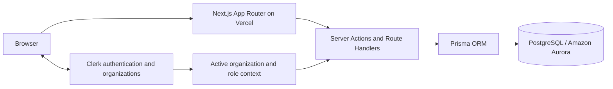
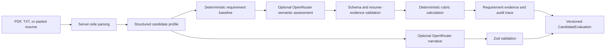
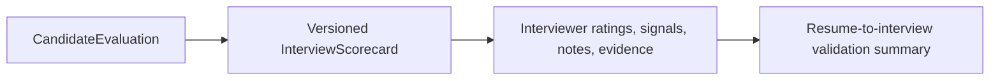

# RecruitIQ

An explainable hiring intelligence platform that turns resumes, job requirements, and interview feedback into structured, evidence-backed candidate evaluations.

**Live demo:** [RecruitIQ on Vercel](https://recruit-iq.vercel.app)
**Repository:** [jumbomuffin101/RecruitIQ](https://github.com/jumbomuffin101/RecruitIQ)

RecruitIQ is designed for startups, lean recruiting teams, and student organizations that need a more accountable alternative to spreadsheet-driven hiring. It keeps the final decision with people while making the reasoning, evidence, and workflow visible.

## Screenshots

New RecruitIQ workspaces start empty. After signing in and creating a workspace, create a job, add structured requirements, upload a candidate resume, and generate an evaluation. Add real captures to [`docs/screenshots/`](docs/screenshots/README.md) using these stable paths:

| Screen | Path |
| --- | --- |
| Landing page | `docs/screenshots/landing.png` |
| Dashboard | `docs/screenshots/dashboard.png` |
| Candidate evaluation | `docs/screenshots/candidate-evaluation.png` |
| Candidate comparison | `docs/screenshots/compare.png` |
| Pipeline | `docs/screenshots/pipeline.png` |
| Interview scorecard | `docs/screenshots/interview-scorecard.png` |

Captures are intentionally not fabricated or generated.

## Core Workflow

1. Create a job with structured requirements and a configurable 100-point rubric.
2. Upload a PDF/TXT resume or paste resume text, then review editable extracted candidate details.
3. Generate a versioned candidate evaluation with deterministic scores and resume-grounded evidence.
4. Compare candidates against a specific job, then move each application through its own pipeline.
5. Generate an interview scorecard, collect human feedback, and validate interview signals against screening evidence.

For a concise 3-5 minute walkthrough, use the [demo script](docs/demo.md).

## Key Features

- Structured job requirements with required/preferred type, critical flags, keyword matching, and per-job rubrics.
- PDF/TXT resume intake with server-side parsing and editable structured candidate fields.
- Deterministic, explainable candidate scoring with requirement-level results and extracted resume evidence.
- OpenRouter-assisted semantic evidence evaluation and recruiter narrative, with deterministic scoring fallback.
- Immutable evaluation history, rubric snapshots, and stale-evaluation visibility.
- Application-specific pipeline stages and status history, including candidates who apply to multiple jobs.
- Interview scorecards with requirement-linked questions, ratings, signals, observed evidence, and feedback validation.
- Organization-scoped workspaces and server-enforced ADMIN, RECRUITER, and INTERVIEWER permissions.
- Recruiter dashboard, candidate comparison, analytics, activity history, and operational health endpoints.

## Architecture







RecruitIQ uses a PostgreSQL-first relational model. Clerk provides session and organization membership; Server Actions derive the active organization and role from Clerk, then Prisma queries and mutations scope hiring data to that workspace. Production is designed for Amazon Aurora PostgreSQL and deployed on Vercel.

## Explainable Evaluation Design

The final score is deterministic and derived from a job's structured requirements and category rubric. RecruitIQ's hybrid evaluation engine follows six steps:

1. Deterministic requirement matching establishes a keyword and evidence baseline.
2. OpenRouter optionally evaluates qualitative semantic evidence for each requirement.
3. Schema, identifier, confidence, and resume-grounding validation filters AI output.
4. Centralized deterministic credit mapping converts approved qualitative assessments to points.
5. Deterministic category weighting produces the final 0-100 score.
6. AI narrative generation receives that final score and its evidence-backed breakdown.

Each AI assessment must use an exact requirement ID and grounded resume excerpt; malformed, fabricated, duplicate, or unknown results are discarded. The LLM does not directly choose the final score.

Every completed evaluation persists the following:

- Category scores and normalized rubric weights.
- Deterministic requirement status alongside an optional AI semantic assessment and confidence.
- Resume excerpts supporting matched or partial requirements, including validated AI-provided excerpts when available.
- Rubric, scoring, and prompt snapshots for historical explainability.
- Recommendation, confidence, and provider metadata.

`HYBRID` evaluations use validated, grounded AI semantic evidence plus the deterministic rubric. Any provider, schema, ID-integrity, or grounding failure produces a `DETERMINISTIC` evaluation instead. OpenRouter can also improve recruiter-facing narrative, but it does not determine the numerical fit score or make a hiring decision. Regenerating an evaluation creates a new historical record rather than overwriting prior results.

## Why This Is Technically Interesting

- **Hybrid AI architecture:** deterministic scoring provides stable, explainable decisions while an optional LLM produces concise recruiter narratives.
- **Evidence-first data model:** requirement results and resume excerpts are persisted alongside evaluation versions.
- **Application-aware workflow:** pipeline state belongs to a candidate-job application, not a global candidate status.
- **Human-in-the-loop validation:** interview feedback can confirm, weaken, or leave screening signals unresolved without mutating the original fit score.
- **Multi-tenant authorization:** Clerk organization context is mirrored safely into Prisma and every workspace query derives ownership server-side.
- **Reliability focus:** unit, integration, and Playwright infrastructure cover scoring, authorization, and browser workflows.

## Tech Stack

- Next.js App Router, React, TypeScript, Tailwind CSS
- Prisma ORM and PostgreSQL, targeting Amazon Aurora PostgreSQL in production
- Clerk for authentication, social sign-in, organizations, and role context
- OpenRouter for optional server-side narrative enhancement
- `unpdf` for serverless, text-based PDF extraction
- Playwright, Node test runner, and PostgreSQL-backed integration tests
- Vercel for deployment and server functions

## Authentication, Tenancy, and Privacy

- Clerk is the only runtime authentication provider. Google and GitHub connections are configured in Clerk.
- Clerk organizations map to RecruitIQ workspaces. Prisma `User` and `Organization` mirrors are linked by Clerk IDs.
- Server Actions and data loaders derive the active organization from Clerk; client input cannot select another workspace.
- Roles use least privilege: ADMIN manages the workspace, RECRUITER manages hiring workflows, and INTERVIEWER submits feedback only.
- Resume uploads are size-limited and parsed server-side. Files are not stored or exposed publicly; extracted text is stored in PostgreSQL.
- RecruitIQ is decision support. It does not automatically hire, reject, or make final employment decisions.

## AI Reliability

OpenRouter is optional. When configured, its output is requested server-side as strict JSON and validated with Zod before semantic-evidence and narrative fields are persisted. For hybrid scoring, it can only provide qualitative requirement evidence; exact requirement IDs, enum values, confidence bounds, and resume-grounded excerpts are validated before use. When a provider key is absent, the request times out, the response is invalid, an ID is unknown or duplicated, or evidence cannot be grounded, RecruitIQ continues with deterministic extraction and analysis. API keys and raw resume contents are never logged or sent to the browser.

RecruitIQ resolves `OPENROUTER_BASE_URL` to one canonical Chat Completions endpoint. Use `https://openrouter.ai/api/v1` in Vercel; `https://openrouter.ai/api/v1/chat/completions` is also accepted explicitly. Workspace administrators can call `/api/ai-status?probe=1` to run a minimal server-side connectivity check. The response includes the configured model, endpoint, status, and sanitized provider error information only.

## Testing

| Layer | Coverage |
| --- | --- |
| Unit | Rubric math, evidence extraction, recommendations, OpenRouter fallback states, and role mapping |
| Integration | Organization isolation and cross-workspace evaluation ownership using disposable PostgreSQL |
| E2E | Clerk-backed resume intake and interviewer permission restrictions using Playwright |
| CI | PostgreSQL 16 service, Prisma migration deployment, lint, unit tests, integration tests, build, and conditional Clerk E2E |

Database-backed tests require a disposable `DATABASE_URL_TEST`. The reset guard rejects production-like Aurora and Neon hosts.

## Local Development

```bash
npm install
cp .env.example .env
npx prisma migrate deploy
npm run dev
```

Required variables:

```bash
DATABASE_URL=""
NEXT_PUBLIC_CLERK_PUBLISHABLE_KEY=
CLERK_SECRET_KEY=
```

Optional OpenRouter variables:

```bash
OPENROUTER_API_KEY=
OPENROUTER_MODEL=openai/gpt-oss-20b:free
OPENROUTER_BASE_URL=https://openrouter.ai/api/v1
OPENROUTER_APP_NAME=RecruitIQ
OPENROUTER_SITE_URL=
```

Useful commands:

```bash
npm run lint
npm test
npm run test:integration
npm run test:e2e
npm run build
```

`npm run db:seed` is intentionally a safe no-op. Production and local workspaces are never populated with fictional recruiting records. Database-backed tests use a separate `DATABASE_URL_TEST` and test-only seed path.

### Optional Legacy Demo Cleanup

Older installations may still contain the legacy organizations with slugs `recruitiq-sample` or `recruitiq-demo`. The cleanup script targets only those exact slugs and never runs automatically:

```bash
CONFIRM_REMOVE_LEGACY_DEMO_DATA=true npx tsx scripts/remove-legacy-demo-data.ts --dry-run
CONFIRM_REMOVE_LEGACY_DEMO_DATA=true npx tsx scripts/remove-legacy-demo-data.ts
```

Review the dry-run output before the second command. The script deletes organizations one at a time, relying on existing organization relation behavior; it does not use an unscoped bulk delete.

## Deployment

1. Provision a PostgreSQL database compatible with Amazon Aurora PostgreSQL and set `DATABASE_URL` in Vercel.
2. Apply reviewed migrations with `npx prisma migrate deploy` from an environment that can reach the database.
3. Configure Clerk production keys, allowed domains, Organizations, and desired Google/GitHub connections.
4. Add optional OpenRouter variables only if narrative enhancement is required.
5. Deploy, then check `/api/health`, `/api/readiness`, sign-in, workspace selection, and one recruiter workflow.

`/api/health` verifies process health. `/api/readiness` performs a minimal database check and returns a safe `503` when the database is unavailable.

## Repository Notes

Suggested GitHub topics: `nextjs`, `typescript`, `prisma`, `postgresql`, `clerk`, `openrouter`, `ai`, `recruiting`, `ats`, `llm`.

Suggested repository description: **Explainable hiring intelligence platform with deterministic candidate scoring, resume evidence, interview validation, and multi-tenant recruiting workflows.**

## Known Limitations

- PDF extraction supports text-based PDFs, not scanned image-only resumes.
- Candidate editing is not implemented yet.
- Resume evidence is excerpt-based rather than highlighted inside a rendered resume.
- The legacy `ResumeAnalysis` and `InterviewKit` tables remain for compatibility while the versioned evaluation model is adopted.
- Local E2E runs require dedicated Clerk test credentials and a disposable PostgreSQL database.

## Future Improvements

- Recruiter invitations and workspace role assignment workflows.
- Calendar and email integrations for interview scheduling and outreach.
- Durable object storage for resumes when retention requirements demand it.
- Automated evaluation monitoring and model-quality review workflows.
- Organization-level configuration for scoring policies and interview templates.

Built by Aryan Rawat.
